# Create Our Own Cluster with Proxmox Server

## Create Minimum Two Instances of Ubuntu

### Create SSH Key:

1. Open a terminal on your host machine (Ubuntu in my case).
2. Run the command `ssh-keygen -b 4096` and provide a name for the key and the path. In my case, I stored it in `~/.ssh/`.

**Example:**

 **Linux Ubuntu:**
<pre><code>ssh-keygen -b 4096 -f ~/.ssh/&lt;give-name-for-file&gt;</code></pre>
 **Windows PowerShell  Administrator**
- The pair key will be created in the default setting in the folder C:\Users\\&lt;your-username&gt;\.ssh
<pre><code>ssh-keygen -t ed25519</code></pre>
- Create the pair key in a specific name and path:
<pre><code>ssh-keygen -t ed25519 -f C:\Users\\&lt;your-username&gt;\.ssh\\&lt;give-name-for-file&gt;</code></pre>
        
**Note:** Make sure OpenSSH client is installed on both Linux and Windows:

  **For Linux Ubuntu:**
<pre><code>sudo apt install openssh-server</code></pre> 
<pre><code>sudo apt install openssh-client</code></pre> 
<pre><code>sudo systemctl start ssh</code></pre> 
<pre><code>sudo systemctl enable ssh</code></pre> 
<pre><code>sudo systemctl enable ssh</code></pre> 
**OR**
<pre><code>sudo apt update
sudo apt install openssh-server
sudo apt install openssh-client
sudo systemctl start ssh
sudo systemctl enable ssh
sudo systemctl status ssh</code></pre>
----
 **For Windows PowerShell  Administrator:**

### **OpenSSH services are off by default:**
- go to your windoes search bar and type <pre><code>services</code></pre>
  services windows pop up scroll down and look for OpenSSH server and agent and You must manually set
  Automatic and Start services.
- **alternative** go to your windoes search bar and type <pre><code>RUN</code></pre>
  RUN windows pop up type in run bar <pre><code>services.msc</code></pre>
  services windows pop up scroll down and look for OpenSSH server and agent and You must manually set
  Automatic and Start services.
  
  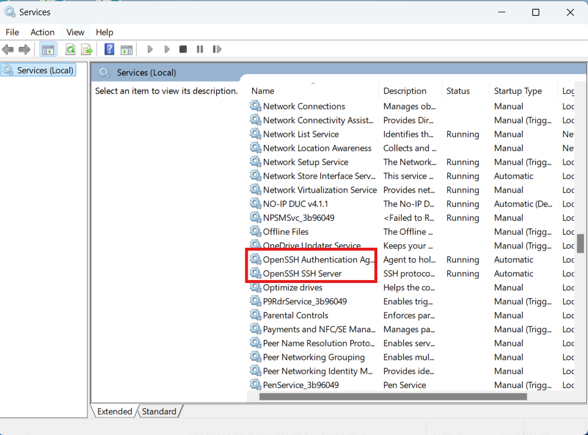
  
**Test firewall on Port 22**
  <pre><code>netstat -na | findstr ":22"</code></pre>
  **OR**
  <pre><code></code>netstat -na | Select-String ":22"</pre>
  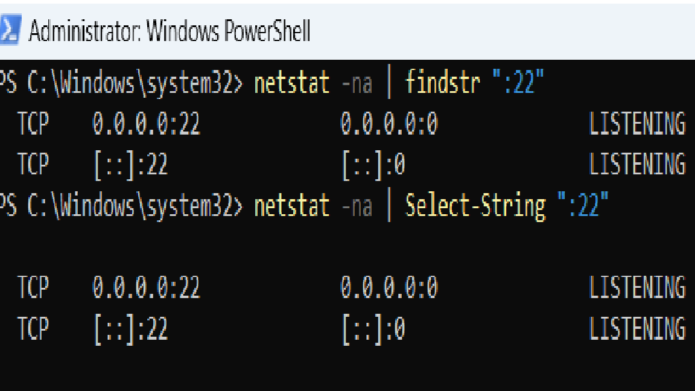
  
**use PS to see if firewall rule is in place**
  <pre><code>Get-NetFirewallRule -Name *OpenSSH-Server* |select Name, DisplayName,
Description, Enabled</code></pre>
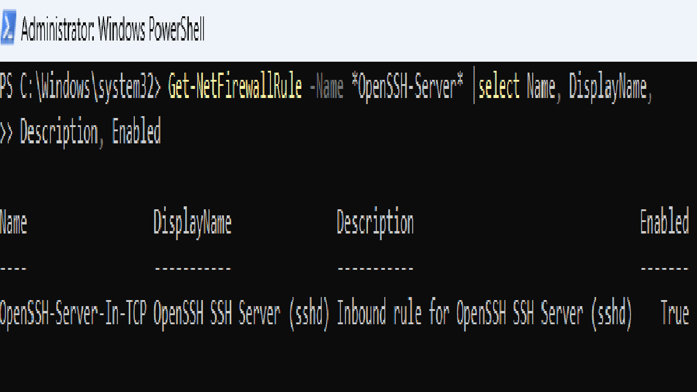

---
**Editing OpenSSH server: sshd_config:**

- Method one to edit sshd_config by Windows GUI:

1. enble the option hidden file, type in windows searh bar <pre><code>File Explorer Options</pre></code>

2. windows File Explorer Options pop up

   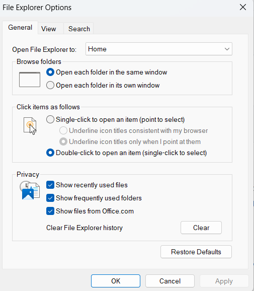
   
3. Choose Veiw and select Show hidden file or folder option

   
   
4. The hidden folder ProgramData will be unhidden the path "c:\ProgramData\ssh\sshd_config",you must open the file
    sshd_config as Notepad administrator so you can save the changes

   <a href="images/sshd_config.png">
      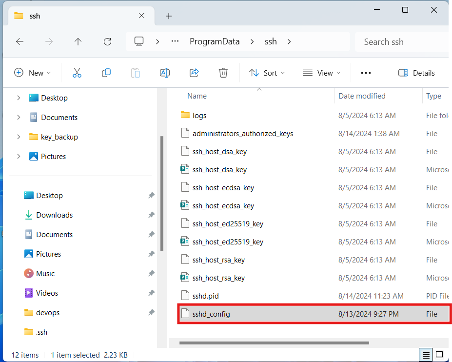
   </a>
   

      <a href="images/sshd_config.png">Expand Image</a>
    

            
6. Opening the notepad as administrator as show below
   
   

      <a href="images/run notepad as administrator.pn">Expand Image</a>
   

    
7. when you open the file sshd_config you can keep it as defaulet or change the setiing as show below
   
   <a href="images/sshd_config_context.png">
      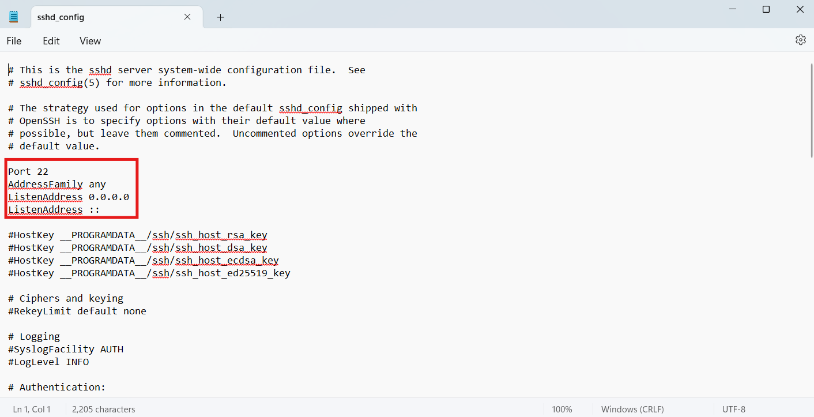
   </a>
   

      <a href="images/sshd_config_context.png">Expand Image</a>
   

         
8. set the sshd_config as show below
         
   
    

        <a href="images/sshd_config_context.png">Expand Image</a>
    

    
   save and exit.
         
   By setting the sshd_config in your the host machine and the other machine you can ssh all the machine
---
   **Mothed two to edit sshd_config by Windows PowerShell:**
  1. type in windows search command PowerShell and the icon PowerShell show
     <pre><code>PowerShell</code></pre>

     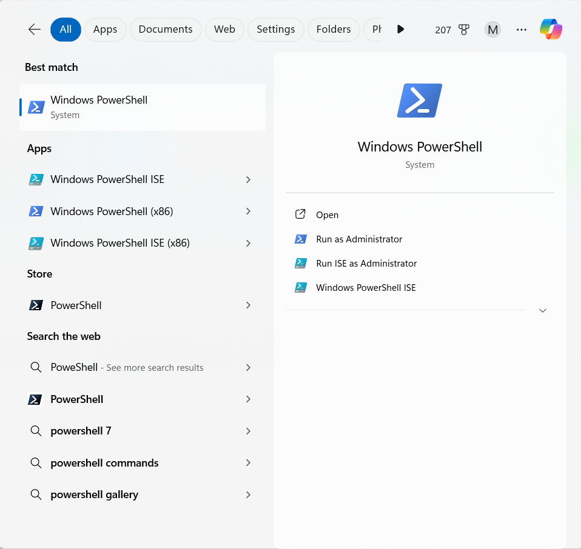
  2. right click of the mouse on the powerShell icon and select Run as administrator

     
  3. windows PoweShell pop up cd to ProgramData\ssh cd "ProgramData\ssh\"
     <pre><code>cd c:\ProgramData\ssh</code></pre>
  4. the PowerShell should look like this C:\ProgramData\ssh\

     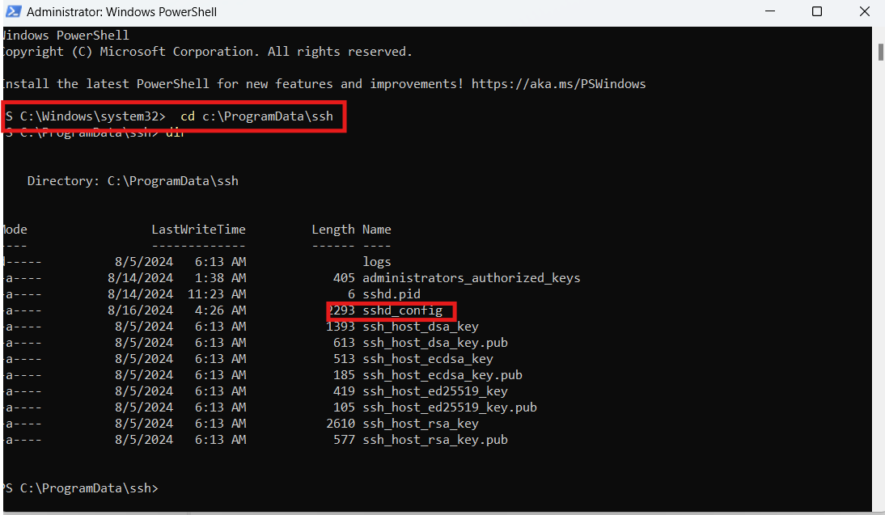
  5. enter this command:
     <pre><code>notepad sshd_config</code></pre>
  6. set the sshd_con as show below

     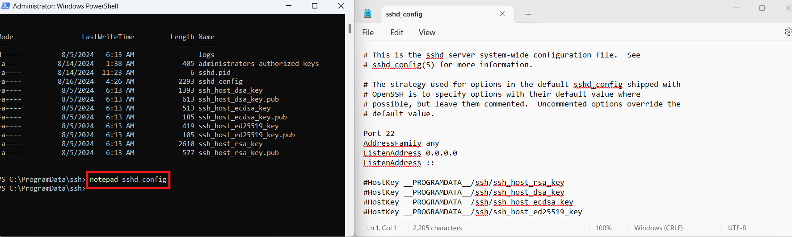
  7. exit and save
---
**Register private key**

#### **ssh-agent**:
1. make sure the ssh-agent enable and at Automatic and Start status, check [OpenSSH services are off by default](#openssh-services-
   are-off-by-default)
2. if the ssh-agent is disable you use services as explain before or you can run this command in PowerShell as adminisrator
   <pre><code>Get-Service ssh-agent | Set-Service -StartupType Automatic</code></pre>
3. Start the service
   <pre><code>Start the service</code></pre>
4. Check status of service
   <pre><code>Get-Service ssh-agent</code></pre>
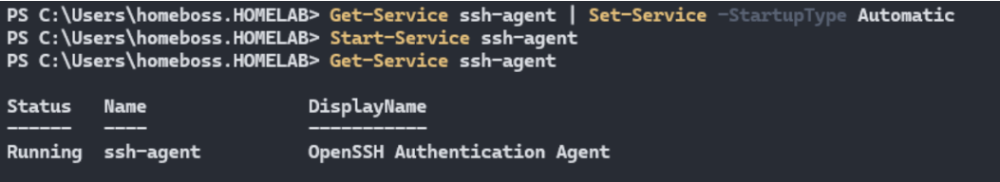

---
### **Register private key with ssh-agent**
- Now load your key files into ssh-agent
  <pre><code>ssh-add $env:USERPROFILE\.ssh\id_ed25519</code></pre>
  **OR**
  <pre><code>ssh-add $env:USERPROFILE\.ssh\&lt;code>your private-key&gt;</code></pre>
  
  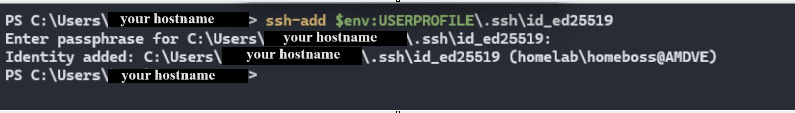
---
### **Deploying the public key**
- Get the public key file generated previously on your client
  <pre><code>$authorizedKey = Get-Content -Path "$env:USERPROFILE\.ssh\id_ed25519.pub"</code></pre>
  **OR
   <pre><code>$authorizedKey = Get-Content -Path "$env:USERPROFILE\.ssh\&lt;your public-key&gt;</code></pre>
- Generate the PowerShell to be run remote that will copy the public key file
  generated previously on your client to the authorized_keys file on your
  server.
<pre><code>$authorizedKey = Get-Content -Path "$env:USERPROFILE\.ssh\id_ed25519.pub"; powershell -Command "Add-Content -Force -Path '$env:ProgramData\ssh\administrators_authorized_keys' -Value '$authorizedKey'; icacls.exe '$env:ProgramData\ssh\administrators_authorized_keys' /inheritance:r /grant 'Administrators:F' /grant 'SYSTEM:F'"
</code></pre>

**OR**

<pre><code>$authorizedKey = Get-Content -Path "$env:USERPROFILE\.ssh\/&lt;your public-key&gt;"; powershell -Command "Add-Content -Force -Path '$env:ProgramData\ssh\administrators_authorized_keys' -Value '$authorizedKey'; icacls.exe '$env:ProgramData\ssh\administrators_authorized_keys' /inheritance:r /grant 'Administrators:F' /grant 'SYSTEM:F'"
</code></pre>
- Login to OpenSSH server host:
  <pre><code></code>ssh username@domain@host $remotePowershell</pre></code>
  for the first time and for last time it will asked for password
  
  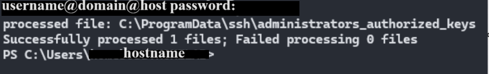
  
  login again but this time **`without the $remotePowershell`**
  
  ssh username@domain@host
  
---
### Copy the Public Key to Your Instances:

After creating the public and private key pair, copy the public key to your instances (master and node1) using the following command:

<pre><code>ssh-copy-id &lt;instance-name&gt;@&lt;instance-ip&gt;</code></pre>

For example:

<pre><code>ssh-copy-id mjoulani@192.168.68.124</code></pre>

### Backup or Snapshot:

Make a backup or snapshot before you start using the Proxmox console.

## Start Creating the Cluster:

1. Connect to the master node and node1.
2. Disable swap for all instances:
    <pre><code>sudo swapoff -a</code></pre>

3. Edit `/etc/fstab` to disable swap:
    <pre><code>sudo nano /etc/fstab</code></pre>
    Comment out the swap line by adding `#` at the beginning:
    <pre><code>#/swap.img</code></pre>

4. Install Docker:
    <pre><code>sudo apt install docker.io -y</code></pre>

5. Add your user to the Docker group:
    <pre><code>newgrp docker
sudo usermod -aG docker mjoulani
sudo chmod 666 /var/run/docker.sock</code></pre>

6. Install `curl` (if not already installed):
    <pre><code>curl --version</code></pre>

7. Merge Kubernetes Community (Master Controller and Node):
    Find the documentation here: <a href="https://kubernetes.io/blog/2023/08/15/pkgs-k8s-io-introduction/">Kubernetes Documentation</a>

    a. Add Kubernetes APT repository:
        <pre><code>echo "deb [signed-by=/etc/apt/keyrings/kubernetes-apt-keyring.gpg] https://pkgs.k8s.io/core:/stable:/v1.28/deb/ /" | sudo tee /etc/apt/sources.list.d/kubernetes.list</code></pre>

    b. Add Kubernetes GPG key:
        <pre><code>curl -fsSL https://pkgs.k8s.io/core:/stable:/v1.28/deb/Release.key | sudo gpg --dearmor -o /etc/apt/keyrings/kubernetes-apt-keyring.gpg</code></pre>

    c. Update package list:
        <pre><code>sudo apt update</code></pre>

8. Install Kubernetes components:
    <pre><code>sudo apt install kubeadm kubelet kubectl kubernetes-cni -y</code></pre>

9. Create a cluster with `kubeadm`. For more information, visit: <a href="https://kubernetes.io/docs/setup/production-environment/tools/kubeadm/create-cluster-kubeadm/">Kubeadm Documentation</a>

10. Setup the Master Controller Node:

    a. Show default route:
        <pre><code>ip route show</code></pre>

    b. Initialize the Kubernetes master:
        <pre><code>sudo kubeadm init</code></pre>

    c. Configure kubectl:
        <pre><code>mkdir -p $HOME/.kube
sudo cp -i /etc/kubernetes/admin.conf $HOME/.kube/config
sudo chown $(id -u):$(id -g) $HOME/.kube/config</code></pre>

    Alternatively, as root:
        <pre><code>export KUBECONFIG=/etc/kubernetes/admin.conf</code></pre>

    d. Apply Calico networking:
        <pre><code>kubectl apply -f https://docs.projectcalico.org/manifests/calico.yaml</code></pre>

    e. Check the status:
        <pre><code>kubectl get pods -n kube-system
kubectl get nodes</code></pre>
        Note: Wait for 5 minutes or more until the nodes are ready. Visit <a href="https://docs.tigera.io/">Tigera Documentation</a> and <a href="https://github.com/projectcalico/calico/blob/master/manifests/calico.yaml">Calico Manifest</a>.

11. Setup the Worker Node:

    Join the cluster using the command provided by `kubeadm init`:
    <pre><code>sudo kubeadm join &lt;control-plane-host&gt;:&lt;control-plane-port&gt; --token &lt;token&gt; --discovery-token-ca-cert-hash sha256:&lt;hash&gt;</code></pre>

12. Manage Node Labels:

    a. Add a label to a node:
        <pre><code>kubectl label nodes node1 role=worker-one</code></pre>

    b. List nodes with labels:
        <pre><code>kubectl get nodes --show-labels</code></pre>

    Alternatively, you can:

    - **Add Labels:**
        <pre><code>kubectl label nodes node1 node-role.kubernetes.io/&lt;name-of-label&gt;=</code></pre>

    - **Show Labels:**
        <pre><code>kubectl get nodes --show-labels</code></pre>

    - **Remove Labels:**
        <pre><code>kubectl label nodes node1 node-role.kubernetes.io/&lt;name-of-label&gt;-</code></pre>

**Notes:**
- Ensure to replace placeholders like `<control-plane-host>`, `<control-plane-port>`, `<token>`, and `<hash>` with your actual values.
